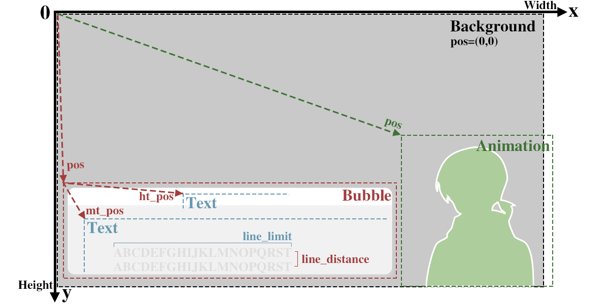

# Introduction


TRPG-Replay-Generator is an automatic TRPG replay video producting tool based on python3 and pygame, which is designed to replace the repetitive work in the production of replay videos and visual novel-like videos, and significantly improve efficiency. This tool contains four subprograms: main program, speech synthesis, export to PR project and export to video. This program completes video production through text-based editing, providing room for customization while maximizing efficiency, as well as providing an easy-to-use graphical interface. This program is easy to use for both those skilled in programming and those new to video production.<br>

## Environment:

**Required by the main program replay_generator:**
1. python &gt;= 3.8.3
2. [pygame](https://github.com/pygame/pygame) &gt;= 2.0.1
3. [numpy](https://github.com/numpy/numpy) &gt;= 1.18.5
4. [pandas](https://github.com/pandas-dev/pandas) &gt;= 1.0.5
5. openpyxl &gt;= 3.0.4

**Additional required to export as a Premiere Pro XML file:**
1. [Pillow](https://github.com/python-pillow/Pillow) &gt;= 7.2.0

**Additional required to export as a MP4 Video:**
1. [ffmpeg-python](https://github.com/kkroening/ffmpeg-python) &gt;= 0.2.0
2. [pydub](https://github.com/jiaaro/pydub) &gt;= 0.25.1
3. Download the [ffmpeg](https://ffmpeg.org/download.html) executable file, and move to the root directory of TRPG-Replay-Generator.

**Additional required by the speech synthesis subprogram:**
1. Install [Alibabacloud Python SDK](https://github.com/aliyun/alibabacloud-nls-python-sdk).
2. Check the [help ducument](https://help.aliyun.com/document_detail/374323.html).
3. Get the [Alibabacloud AccessKey, AccessKey_Secret, Appkey](https://ram.console.aliyun.com/manage/ak).

## Download

[**Executable** 93.8MB](https://github.com/DanDDXuanX/TRPG-Replay-Generator/releases/download/v1.0.4/TRPG-Replay-Generator-v1.0.4-win64.7z)

[**Source Code** 25.1MB](https://github.com/DanDDXuanX/TRPG-Replay-Generator/releases/download/v1.0.4/TRPG-Replay-Generator-v1.0.4-SourceCode.7z)

## Quickstart

### 1. Using source code release

1. Download the sourcecode release, and unzip the 7z file.
2. Insure the python environment is installed exactly, and run the following command in terminal in the root directory of TRPG-Replay-Generator.
```bash
pip install -r ./requirements.txt
```
3. Run command below to start the example project.<br>
```bash
python ./replay_generator.py -l ./toy/LogFile.txt -d ./toy/MediaObject.txt -t ./toy/CharactorTable.csv
```
4. After enter the program, press SPACE to start the display. During display, press key A to jump to the previous section, key D to jump to the next section, SPACE to pause the display, F5 to show details, F11 to zoom the screen to 50%, and ESC to terminate display and exit.

### 2. Using executable release

1. Download the executable release, and unzip the 7z file.<br>
2. Run `TRPG-Replay-Generator-v1.0.0.exe` to open the GUI.
3. Enter `./toy/MediaObject.txt`, `./toy/CharactorTable.csv`, `./toy/LogFile.txt` to MediaDef, CharTable, RplGenLog field, respectively.
4. Press START button to start the example project.<br>
5. After enter the program, press SPACE to start the display. During display, press key A to jump to the previous section, key D to jump to the next section, SPACE to pause the display, F5 to show details, F11 to zoom the screen to 50%, and ESC to terminate display and exit.

> Note: The executable release can run without python environments, however it is slightly less efficient and stable than running the sourcecode.

# Documents (Doc.Ver alpha 1.10.2)

## Input file format

A project of this program include 3 text file, which are media definition file (MediaDef), character profile (CharTable), and script file (RplGenLog). All text file used as input files must be encoded with `utf-8`.

### 1. MediaDef

The media objects needed in project is defined in MediaDef, as the resources for call. The syntax of MediaDef use a syntax similar to python class instantiation.<p>
In current version, all available Classes are list below:



1.	**Text, StrokeText**
```python 
Text(fontfile='./assets/SourceHanSansCN-Regular.otf',fontsize=40,color=(0,0,0,255),line_limit=20)
StrokeText(fontfile='./assets/SourceHanSansCN-Regular.otf',fontsize=40,color=(0,0,0,255),line_limit=20,edge_color=(255,255,255,255))
```

- Text object is part of Bubble object, and cannot be called directly as media.
- `fontfile`	Optional argument, specify a path of font file. The default value is `SourceHanSansCN-Regular`.
- `fontsize`	Optional argument, specify an integer greater than zero as the size of font. The default value is 40.
- `color`	Optional argument, specify a tuple containing 4 elements as the color of font. Each element must be an integer ranged in 0-255, which means red, green, blue, and alpha channel, respectively. The default value is (0,0,0,255), which means black.
- `line_limit`	Optional argument, specify the maximum character number to be display in a line. Strings exceeds the limit will Trigger an automatic line feed. The default value is 20.
- `edge_color`	Optional argument, specify a RGBA color tuple as the stroke color of font. This argument is only avaliable in type `StrokeText`. The default value is (255,255,255,255), which means white.  

> Note: Since the `Bubble` object needs to reference the `Text` object, the `Text` object's location in the MediaDef file must precede the definition of the `Bubble` object!

2. **Bubble**
```python
Bubble(filepath,Main_Text=Text(),Header_Text=None,pos=(0,0),mt_pos=(0,0),ht_pos=(0,0),align='left',line_distance=1.5)
```

- Bubble means the text boxes of to display the content of the character's speech. A Bubble contains three components: the main text, the header text, and the bottom image.
- `filepath`	Necessary argument, specify a path of image file. A path to a blank bottom image is required, even if there is no bottom image to be display for this Bubble.
- `Main_text`	Optional argument, specify a  `Text` or `StrokeText` object for the main text. The main text corresponds to the *speech text* in the *RplGenLog*. The default value is A `Text` object instantiated with default arguments. `Main_text` should not be set to None.
- `Header_text`	Optional argument, specify a  `Text` or `StrokeText` object for the header text. The header text corresponds to the character name in the *RplGenLog*. The default value is `None`, which mean absence.
- `pos`	Optional argument, specify a tuple containing 2 elements as the postion of `Bubble`. Each element mean X, Y, respectively. The default value is (0,0), which mean the upper left corner of canvas.
- `mt_pos`	Optional argument, 